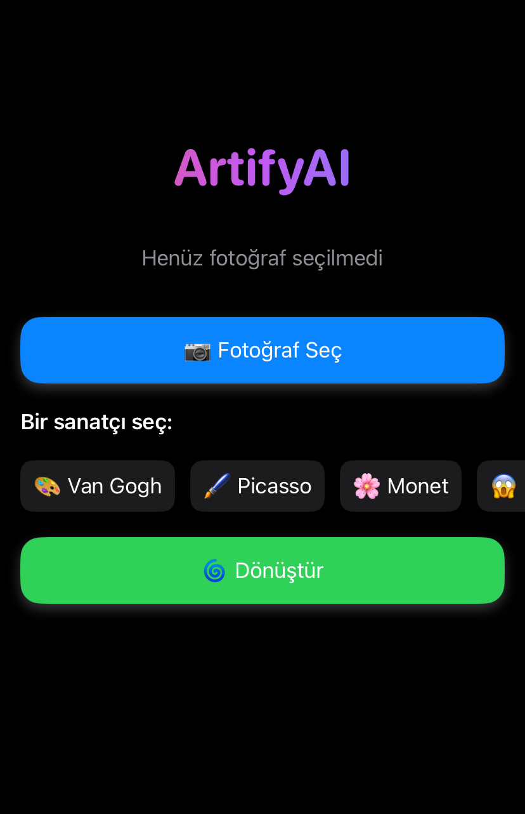

# 🎨 ArtifyAI

ArtifyAI is an iOS application that transforms your photos into stunning artworks inspired by legendary artists like **Van Gogh**, **Picasso**, and **Monet** using neural style transfer techniques.

## 📱 Screenshots

## ✨ Features

- 📸 Select a photo from your device
- 🎨 Choose from iconic artist styles:
  - Van Gogh 🌻
  - Picasso 🎭
  - Monet 🌸
  - Surprise style 😱
- 🌀 Instantly transform your photo into a work of art

## 🧠 Technology Stack

- Swift & SwiftUI
- CoreML (planned for NST model integration)
- Python (for training NST models)
- Git & GitHub for version control

